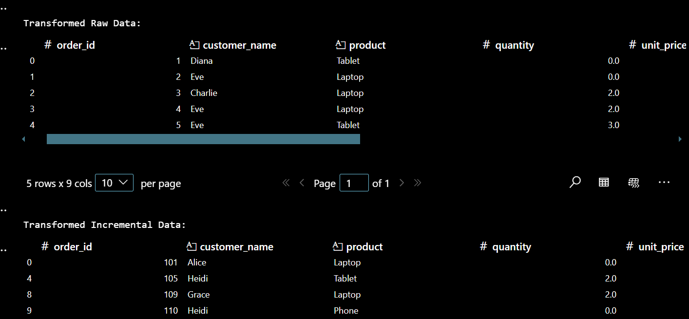

# DSA2040A_ETL_Midterm_TRIZAH_074
# ETL Midterm – Data Warehousing and Mining

## 1. Project Overview

This project demonstrates a full ETL (Extract → Transform → Load) pipeline. It extracts raw sales data from CSV files, applies several meaningful transformations, and loads the cleaned data into SQLite databases. The project simulates how data flows through a warehouse pipeline in a real business setting.

---

## 2. ETL Phases

### ➤ `etl_extract.ipynb`
- Loads and previews `raw_data.csv` and `incremental_data.csv`
- Displays `.head()` and `.info()` for each
- Observes missing values, duplicates, and structure issues
- Saves files in the `data/` folder

### ➤ `etl_transform.ipynb`
- Applies key transformations:
  - Removes duplicate rows
  - Drops rows with missing critical fields (`customer_name`, `product`, `order_date`)
  - Fills missing `quantity` and `unit_price` with 0
  - Adds `total_price` column
  - Converts `order_date` to datetime
  - Categorizes customers into spending tiers (Low, Medium, High)
- Saves outputs to the `transformed/` folder

### ➤ `etl_load.ipynb`
- Loads transformed CSVs into SQLite databases using `sqlite3`
- Saves `full_data.db` and `incremental_data.db` in the `loaded/` folder
- Runs a SQL query to preview stored results

---

## 3. Tools Used

- Python 3
- Pandas
- SQLite (`sqlite3`)
- Jupyter Notebook
- OS module

---

## 4. How to Run the Project

1. **Clone or download** this GitHub repository.
2. Open all `.ipynb` notebooks using **Jupyter Notebook** or **VS Code**.
3. Run in order:
   - `etl_extract.ipynb`
   - `etl_transform.ipynb`
   - `etl_load.ipynb`
4. Check the following folders:
   - `data/` – for input CSV files
   - `transformed/` – for cleaned CSVs
   - `loaded/` – for SQLite `.db` files
5. Optional: You can use DB Browser for SQLite to explore `.db` files visually.

---

## 5. Screenshot

### Transformed Sample Data:

> _Note: Upload your screenshot inside a `screenshots/` folder and rename it `transformed_sample.png` to match this path._
